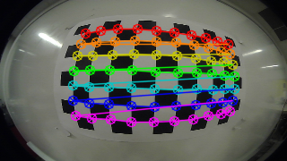
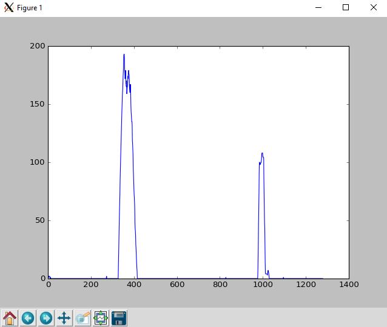
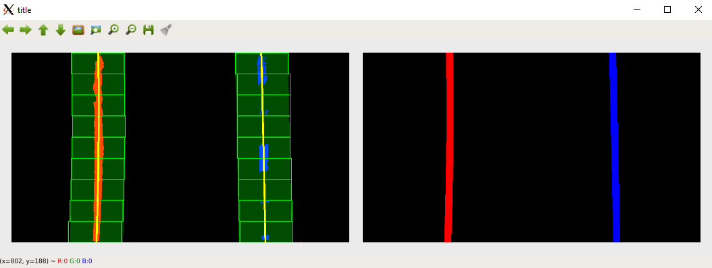
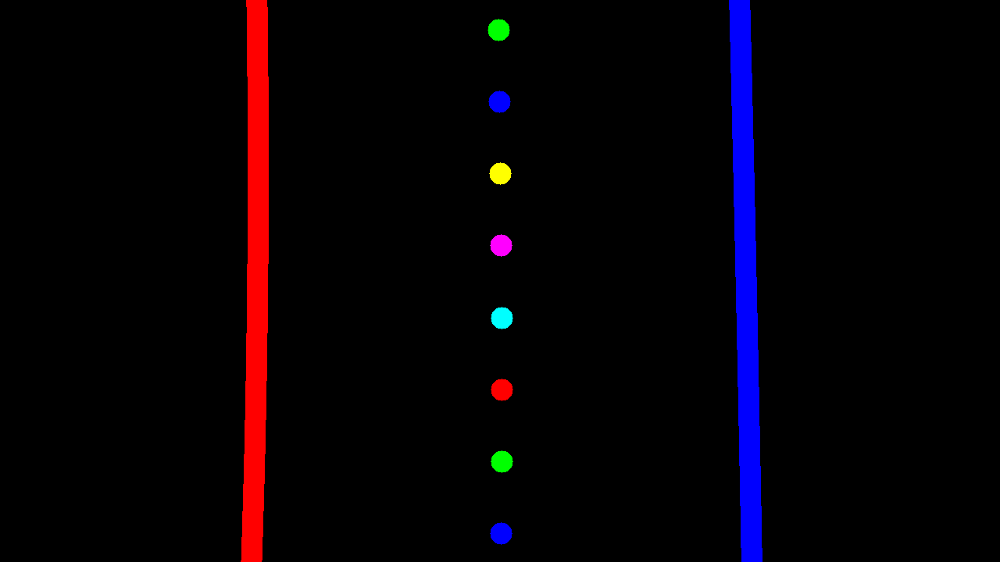

# EEC 193A Lab 1 Part 2: Lane Line Detection

In this project, you will work in groups of 3 to write a software pipeline using traditional computer vision techniques in C++ to identify the lane boundaries in a video and use those lane boundaries to output waypoints that a self-driving car would follow. This project will also give you initial exposure to the following software tools, libraries, and concepts: Git, Docker, CMake, OpenCV, Boost, and Smart Pointers. However, all the aforementioned are simply tools to help you develop a working lane line detection pipeline. They are not the main focus of this project. The main focus is to ensure you understand the general steps of the lane line detection algorithm and how to implement those steps at a high-level.

The main component of this lab will be OpenCV. We will be using OpenCV 3.4.4.
Throughout this assignment, you may find it useful to refer to the offical
OpenCV documentation: [opencv-docs](https://docs.opencv.org/3.4.4/)

## Setting up the Environment
Your environment will be contained in a docker container. You will need to create your container from the eec193_lab1 docker image which is already on the two GPU servers dedicated to this course: ```atlas.ece.ucdavis.edu``` and ```kronos.ece.ucdavis.edu```. However, you do not have to do your work remotely
on the provided servers. We also provide a Dockerfile if you would like to do
this project on your own machine using your favorite text editor.

SSH into the machines using the following commands:
```
# for atlas.ece.ucdavis.edu
ssh -Y kerberos_id@atlas.ece.ucdavis.edu

# for kronos.ece.ucdavis.edu
ssh -Y kerberos_id@kronos.ece.ucdavis.edu
```

Or if you'd like to work on your host machine, first make sure you download
docker community edition for your operating system: [docker-ce](https://docs.docker.com/install/)

Then download this Dockerfile, make sure you are in the same directory as the Dockerfile, and run the following command:

```
docker build -t eec193_lab1 .
```

This may take anywhere from 5-60 mins depending on your internet speed. Once
completed, verify the image ```eec193_lab1``` exists by running the following
command:

```
docker images
```

Once you are on a machine with the eec193_lab1 image, run the following command to mount your container:
```
docker run -it --name=lanelines -v <any_path_on_host_machine>:/root/eec193_lab1 eec193_lab1
```

The ```--name``` flag creates a docker container named "lanelines" which will
be your project environment.

The ```-v``` flag mounts a shared volume between your docker container and host machine. This will allow you to modify code files in your docker container from
your host machine. It is highly recommended that when you choose the folder
on your host machine that the folder is empty so that your project folder isn't
full of unnecessary clutter.

Whenever you wish to enter your docker container again, make sure it is running
by running the command:

```
docker container ls
```

If you don't see the container "lanelines", then you need to start it by
running the following command:
```
docker start lanelines
```

Enter your docker container by running this command

```
docker exec -it -e DISPLAY=<IPv4_Address>:0.0 lanelines /bin/bash
```

The ```-e``` flag passes an environment variable, which in this case is your ```DISPLAY``` variable. This is to forward your display port so you can view images from your docker container. You can find your IPv4_Address by typing ```ifconfig```.

Once inside your docker container, change to the appropriate directory.

```
cd /root/eec193_lab1
```

## The Pipeline
Before going into lower-level details of each step of the lane line detection, we will first give a summary of every step in the pipeline.

* Compute the camera calibration matrix and distortion coefficients given a set of chessboard images.
* Apply a distortion correction to the raw input images.
* Apply a perspective transform to transform the image into a "birds-eye view."
* Use color and gradient thresholds to isolate the lane line pixels, creating a
binary image.
* Cluster the lane lines into their individual instances using the window search
algorithm
* Find the polynomial best-fit lines for each lane line
* Use the best-fit lines to generate waypoints
* (Optional) Calculate other potentially helpful information such as center
offset, radii of curvature, etc.
* (Optional) Use history information to smooth the best-fit lines across frames,
such as using a simple-moving average or other filtering techniques
* Warp the detected lane boundaries and waypoints back onto the original image.
* Output visual display of the lane boundaries and waypoints

## Phase 1: Camera Calibration
This project is broken into two CMake projects. The first of which is the camera
calibration. You may find this project at ```camera_calibration/```.
You will be modifying ```src/calibrate_camera.cpp``` and ```src/intrinsics_tester.cpp```.

In order to accurately measure distance from images, we must first correct any
distortions caused by the lens of the camera. This is done by taking pictures
of a well-defined, high-contrast object at different angles: a checkerboard.
Using a set of checkerboard images, we can obtain a camera matrix and list of
distortion coefficients which can be used to undistort images from a particular
camera.

We have provided you with two sets of checkerboard images from two different
cameras. One is a set of checkerboard images provided by Udacity which are
located at ```camera_calibration/camera_cal/```. The other set
was taken at UC Davis which is located at
 ```camera_calibration/calibration_images/```. We would like you to
  find the camera matrix and list of distortion coefficients for both cameras.

Finish all the TODOs in
```camera_calibration/src/calibrate_camera.cpp``` to find the camera
matrix and distortion coefficients, which will then be saved to a yaml file.
Be sure you are saving the drawn chessboard corners images to
```camera_calibration/drawn_corners/```. To help verify everything
was done correctly, there should be at least 20 images in that folder with
checkerboard corners drawn. The drawn corners will look like something like the
below picture.



To finally verify your camera calibration, finish
```src/intrinsics_tester.cpp```. All you need to do
is use your camera matrix and list of distortion coefficients saved in your yaml file to undistort any 8 checkerboard images and visually verify
they are undistorted. Be sure to show the distorted and undistorted images
side-by-side.

If you are undistorting the images provided by the UC Davis camera, your results
should look similar to this:


The functions you will need for this
part are ```cv::cvtColor```, ```cv::findChessboardCorners```, ```cv::drawChessboardCorners```,
```cv::calibrateCamera```, ```cv::undistort```.

### Basic Build Instructions
These instructions should be followed from the top project directory.

1. cd ```camera_calibration```
2. Make a build directory: ```mkdir build```
3. Move to build directory: ```cd build```
4. Generate Makefile: ```cmake ..```
5. Build project: ```make```

### Running the executables

This will generate the executables ```calibrate_camera```, and ```instrinsics_tester```.

To run the first executable:
```
./calibrate_camera <path_to_yaml_file> <path_to_checkerboard_images>\*.png
```

To run the second executable:
```
./intrinsics_tester <path_to_yaml_file> <path_to_checkerboard_images>\*.png
```

NOTE: you may have to change the extension to *.jpg if the images are JPEG.

Your yaml files should be saved in the top directory. For the Udacity camera,
name the yaml file ```udacity_parameters.yaml```. For the UC Davis camera,
name the yaml file ```fisheye_parameters.yaml```.

## Phase 2: Lane Line Detection
This is the real lane line detection project. It is another CMake project that
is located at ```lane_line_detection/```.

This project is purposefully broken into many subparts. Most of them with their
own module file and tester file. This is to both ensure you build your program
incrementally and to allow you to parallelize your work.

Throughout this project, you will be working with the same 8 test images located
at ```images/test_images/``` until you have built the full pipeline. Once you
are satisified with how your lane line detection is behaving on the 8 test
images, you will run your pipeline on a test video.

### Phase 2.1 Perspective Transformation
To more easily isolate the lane line pixels, it helps to get a birds-eye
view of the road, so we cut out unnecessary information. You will do that
by performing a perspective transformation.

This is done by defining four source points which define your ground plane
and four destination points which define where your ground plane will appear
in the birds-eye view.

You will be modifying ```perspective_transform_tester.cpp``` to apply the
perspective transformation to 8 test images provided at ```images/test_images/```.

The goals of this part are as follows:
* Tune the source and destination points appropriately to get an accurate birds-eye view
* Save the final birds-eye view images to ```images/warped_images/``` for use in the next part

Your source and destination points will be in the yaml file. This is so you don't
have to re-compile every time you wish to modify your source and destination
points.

Copy and paste the following to the bottom of ```udacity_parameters.yaml```.

```
# Order: bottom left, top left, top right, bottom right
source points: [ 0., 400.,
                 300., 720.,
                 900., 720.,
                 720., 400. ]

# Order: bottom left, top left, top right, bottom right
destination points: [ 100., 0.,
                      100., 600.,
                      1000., 600.,
                      1000., 0. ]
```

The source and destination points are not correct. You will have to adjust
them yourself. You are provided with a helper function ```draw_viewing_window```
to help you visualize your source and destination points. Below is an example
of how to use it:

```
// draw green source points on your source image with thickness of 5
draw_viewing_window(src_img, src_points, cv::Scalar(0,255,0), 5);
```

When applying the perspective transformation, be sure you are first undistorting
the image using ```cv::undistort```!! If you do not have the camera matrix and
distortion coefficients yet, you can still do this part of the lab without
undistorting the images, but be sure to come back and undistort the images
when you do get the camera matrix and distortion coefficients.

Your source points should define your ground plane. Use an image with straight
lane lines to help you do this. Your source points should draw out a trapezoid
. Be sure to visually verify they are what you expect.

Here's an example:


Your destination points should define a rectangle located at the bottom
of the image. The smaller the area of this rectangle, the more zoomed out your
birds-eye view will be. The larger the area, the more zoomed in you will be.

Use your source and destination points to obtain the perspective
transform matrix using ```cv::getPerspectiveTransform```. Then apply the
perspective transformation on the 8 test images using ```cv::warpPerspective```.

Here's roughly what your drawn destination points should look like. However, your
destination points do not need to be exactly the same. It's up to you to decide
your own magnification factor.


#### Basic Build Instructions
These instructions should be followed from the top project directory.

1. cd ```lane_line_detection```
2. Make a build directory: ```mkdir build```
3. Move to build directory: ```cd build```
4. Generate Makefile: ```cmake ..```
5. Build project: ```make```

#### Running the executable

This will generate many executables. However, for this part,
you only need to worry about ```perspective_transform_tester```.

To run the executable:
```
./perspective_transform_tester <path_to_yaml_file> <path_to_test_images>\*.png
```
NOTE: you may have to change the extension to *.jpg if the images are JPEG.

When you are satisfied with your birds-eye view, save the birds-eye-view images
(without the drawn destination points) to ```images/warped_images/``` using
something like ```cv::imwrite```, so you can use them for the next part.

### Phase 2.2 Color and Gradient Thresholds

To properly isolate the lane line pixels, you will apply color and gradient
thresholds.

If you have not finished Phase 2.1, then you may use the provided example
warped images located at ```images/example_warped_images/``` to cmplete this
phase.

The files you'll be modifying for this part are ```src/thresholds.cpp```,
```src/thresholds_tester.cpp```, and ```include/thresholds_tester.hpp```.

The goals of this part are as follows:
* Finish the function ```abs_sobel_thresh```
* Finish the function ```sobel_mag_dir_thresh```
* Write your own function, with an API you decide, ```apply_thresholds```
* Save the final results to ```images/thresholded_images/```

Throughout this part, it may be most efficient for you to complete one function,
test it in ```src/thresholds_tester.cpp``` through visualization, make sure it
looks correct, and do this for all three functions. However, when you finish
defining ```apply_thresholds```, your tester file should just be a for-loop
that is using ```apply_thresholds``` on all your warped images, visualizing the
results, and saving them.

#### Basic Build Instructions
These instructions should be followed from the top project directory.

1. cd ```lane_line_detection```
2. Make a build directory: ```mkdir build```
3. Move to build directory: ```cd build```
4. Generate Makefile: ```cmake ..```
5. Build project: ```make```

#### Running the executable

This will generate many executables. However, for this part,
you only need to worry about ```thresholds_tester```.

Run this command to execute:
```
./thresholds_tester <path_to_warped_images>
```


#### Phase 2.2.1 abs_sobel_thresh
The function ```abs_sobel_thresh``` uses the Sobel algorithm to find the gradient
of the image with respect to x or y, takes the absolute value of the gradient,
and applies some upper and lower thresholds, returning some binary image.

Below are some example images with the corresponding function calls:
```
abs_sobel_thresh(warped_img, sobelx_img, 'x', 15, 40, 100);
```


```
abs_sobel_thresh(warped_img, sobely_img, 'y', 15, 40, 100);
```


Your images do not need to look exactly the same given the same inputs.
But they should be very similar.

The steps are as follows:
1. Find gradient with respect to x or y depending on input ```char orient```
2. Take absolute value of gradient
3. Normalize all values to be between 0-255
4. Convert image to type CV_8U (8-bit unnsigned cv::Mat)
5. Apply thresholds

Be sure to normalize before converting the image to 8-bit unsigned ints, or else
you will lose information, and it will be wrong!

When you do normalize, it's up to you, but you don't need to write a for-loop
iterating through every pixel. It is easy to do pixel-wise math
with ```cv::Mat```.

Here's an example of performing pixel-wise multiplication and division:

```
img = 2*img/5;
```
Performing pixel-wise addition and subtraction is just as intuitive.

Some opencv functions you might find useful: ```cv::Sobel```, ```cv::abs```,
```cv::minMaxLoc```, ```cv::Mat::convertTo```, ```cv::threshold```,
```cv::bitwise_and```, ```cv::bitwise_or```.

For the thresholding, you don't necessarily have to use opencv functions like
```cv::threshold```. You could just do this:

```
img_thresholded = img > 20 & img < 100;
```

```img``` is of type ```CV_8U``` with 1 channel. The resulting image will be a
binary image of values 255 and 0. Any pixel values between 20 and 100 will be 255.
The rest will be 0. You can use the ```|``` operator for logical or.

While there is no threshold range that will perfectly isolate the lane line
pixels for all the images, try as best as you can to isolate the lane line pixels
using ```abs_sobel_thresh```.

#### Phase 2.2.2 sobel_mag_dir_thresh
The function ```sobel_mag_dir_thresh``` uses the Sobel algorithm to find the
magnitude and direction of the gradient of an image and applies some lower and
upper thresholds. So there will be two output images.

Below are some example images with the corresponding function call:

```
sobel_mag_dir_thresh(warped_img, sobel_mag_img, sobel_dir_img, 15, 20, 100, 0.0, 0.2);
```


The middle image is the magnitude of the gradient after thresholds. The far-right
image is the direction of the gradient after thresholds.

The steps are as follows:

1. Find both the gradient with respect to x and y
2. Take the absolute value of the gradient images
3. Calculate the magnitude and direction of the gradient
4. Normalize the magnitude of the gradient to be between 0-255
5. Convert the magnitude of the gradient to type ```CV_8U```
6. Apply thresholds for both the magnitude and direction

Notice how we only need to normalize the magnitude of the gradient, not the
direction of the gradient. This is because we are keeping the direction of the
gradient as a floating type. The values will always be between 0 and pi/2 radians.  

The OpenCV functions you'll need are the same as Phase 2.2.1, but you'll also
need ```cv::cartToPolar``` to calculate the magnitude and direction.

Once again, there is no threshold range that will perfectly isolate the lane line
pixels, but you can do better by logically and-ing and or-ing the different
gradient images.

Some examples:

You can try logically  and-ing all your gradient images.

```
img_thresholded = gradx & grady & grad_mag & grad_dir;
```

You can try using a combination of logical and and logical or.

```
img_thresholded = (gradx & grady) | (grad_mag & grad_dir);
```

Try different things. You may find that some gradient thresholds are not
as useful as others. You do not have to use all of them.

### Phase 2.2.3 apply_thresholds
This is to ensure your code is modularized. ```apply_thresholds``` will wrap
all the threshold functions you want to call into one function call. You may
define the inputs and outputs however you want. The only requirement is that
the input and output must be of type ```cv::Mat```. You will need to define the
function prototype in ```include/thresholds.hpp``` and the actual implementation
in ```src/thresholds.cpp```.

Other than applying your gradient thresholds, you also need to apply color
thresholds in your ```apply_thresholds``` function. OpenCV makes this really easy
with its ```cv::inRange``` function.

When trying to isolate the lane line pixels using colors, you will find that
the RGB color model does not provide an easy way to do this. Instead, it is easier
to isolate the lane line pixels using channels of images which are of a
different color space. Some color spaces you may find useful are ```HLS``` and
```LAB```. The L channels are generally good at extracting the white pixels,
while the S and B channels are generally good at extracting the yellow pixels.

While not required, you may want to first view each of the channels individually
to see for yourself which channels are most useful for extracting the lane line
pixels. ```cv::extractChannel``` would be useful for that.

When you're done deciding on your color thresholds, you should decide how you
want to logically and/or your gradient and color thresholded images, and make
sure it is all wrapped inside the ```apply_thresholds``` function.

Example thresholded images are provided in ```images/example_thresholded_images/```.

### Phase 2.3 Defining a Lane Line Class
Before we move onto the window search, it will be useful to define a lane line
class so our code will be more scalable. In this phase you will be modifying
```include/lane_line.hpp``` and ```src/lane_line.cpp```.

I have included a lane line class definition in ```include/lane_line.hpp``` that
is very similar to the one a TA used and is extremely bare bones. There is nothing
in this lane line class that allows for using history information, which you may
find important to incorporate once you are testing your algorithm on videos. You
may also wish to add visualization methods to your lane line class, or they could
be entirely separate functions. You will be provided with helpful visualization
code in the next few phases. You may use this lane line class as a starting point
or create your own. It is all up to you.

Be sure to also write the corresponding ```lane_line.cpp``` for the actual
implementation of your lane line class. At bare minimum, implement a
constructor. If you decide to keep the ```fit``` method, you may figure that part
out later when you've clustered the lane line pixels with the window search.

You may use the following for the pixels to meters conversion factors:

```
xm_per_pix = 3.7/700.
ym_per_pix = 30./720.
```

### Phase 2.4 Window Search
To cluster the lane lines, we will use window search. Window Search is a
clustering algorithm particular to clustering lane lines. We need to be able to
cluster the different instances of lane lines to find the best-fit lines.

In this phase, you will be modifying ```window_search.cpp``` and ```window_search_tester.cpp```.

The goals are as follows:
* Use the window search algorithm to cluster the lane lines in the 8 test images
* Visualize the window search
* Compute the best-fit lines
* Visualize the best-fit lines
* Compute the waypoints in both pixels and meters
* Visualize the waypoints

#### Phase 2.4.1 Implementing the Window Search

The window search algorithm starts by looking at the column-wise histogram peaks
on the left and right-hand side of the binary warped image, choosing the largest
peaks for each side. The locations of these peaks are where the window searches
will start.

Below is an example of the histogram for a particular binary warped image
(not exactly to scale):





Once you've defined your starting position, the window search re-centers itself
based on the mean position of the non-zero pixels inside the window until it
reaches the boundaries of the image.

You may re-center based on both x and y position or only x position. Re-centering
based only on x position is faster as this allows you to control the number of
windows. However, for sharp curvature, re-centering based on both x and y position
may become unavoidable. For this lab, you should only need to re-center based on
x position.

The psuedo-code for the window search algorithm is as follows
```python
n_windows = 9 # number of windows
margin = 100 # width/2 of the window
minpix = 75 # minimum number of pixels required to re-center window
x_current = getPeakBase() # starting x position of window search

for window in range(n_windows):

  Update top, bottom, left, and right sides of window

  drawRectangle() # draw the rectangle for debugging

  colorNonZero() # color in the non-zero pixels inside of window for debugging

  good_inds = findNonZero() # obtain list (cv::Mat) of non-zero pixel locations in window

  if good_inds is not None:

    good_inds_x = good_inds[:,:,0] # extract all x positions from first channel
    good_inds_y = good_inds[:,:,1] # extract all y positions from second channel

    line_inds_x.append(good_inds_x) # Push x values to list (cv::Mat) of all x values
    line_inds_y.append(good_inds_y) # Push y values to list (cv::Mat) of all y values

    if (len(good_inds) > minpix):
      x_current = mean(good_inds_x) # update x position of window

```

For visualizing the window search, you may find the code below useful:

```C++
// draw window green
cv::rectangle(window_img, cv::Point(win_left, win_bottom),
cv::Point(win_right, win_top), cv::Scalar(0,255,0), 2);

// color in pixels inside of window according to color of lane line
window_img(cv::Range(win_bottom,win_top),
cv::Range(win_left,win_right)).setTo(lane_lines[i]->color,
binary_warped(cv::Range(win_bottom,win_top),
cv::Range(win_left,win_right)) != 0);
```

Here's what your window search should look like this:


You need to call the window search for every lane line you are looking for, which
in this case is two. This should all be wrapped nicely in the ```window_search```
function defintion provided to you in ```include/window_search.hpp``` and ```src_window_search.cpp```.

NOTE: You are allowed to change the function definition for window_search. The
only requirement is that it should take in a binary warped image and some list
of pointers on lane lines as inputs and output a visualization of the window
search. You don't have to use smart pointers on lane lines. You may use C-Style
pointers. However, if you're going to use C++, you might as well use what C++
has to offer and not use C-Style pointers...

#### Phase 2.4.2 Calculating the Best-Fit Lines

Once you have finished window search for one lane line, you need to find the
best-fit line for that lane line. Remember that the lane lines are functions of
y, not x. You may use the ```linspace```, ```polyfit```, and ```polyval```
functions defined in ```include/signal_proc.hpp``` and ```src/signal_proc.cpp```
to help you with this. Use a second order-polynomial to fit the lane lines.


Here's an example:

```C++
// get best-fit coefficients of second-order polynomial
polyfit(line_inds_y, line_inds_x, best_fit, 2);

// generate y-values for plotting best-fit line
linspace(0, binary_warped.rows, binary_warped.rows-1, ploty);

// generate x values of best-fit line
polyval(ploty, fitx, best_fit);
```

Be sure tofind the best-fit lines both in pixels and meters.

You will probably want to visualize the best-fit lines on both your window
search image and on your original input image. This will require drawing
best-fit lines on two images as shown below:
```C++
/*
 * NOTE:
 * In this context, left_line and right_line are not lane lines!
 * Instead, they define the left and right line boundaries of one lane line.
 * Also, margin is the margin variable used in the window search algorithm.
 */
cv::Mat pts1, pts2, left_line, right_line, poly_img;

// make left line boundary of lane line
std::vector<cv::Mat> left_merge = {fitx-margin, ploty};
cv::merge(left_merge, left_line);

// make right line boundary of lane line
std::vector<cv::Mat> right_merge = {fitx+margin, ploty};
cv::merge(right_merge, right_line);
cv::flip(right_line, right_line, 0);
cv::vconcat(left_line, right_line, pts2);
pts2.convertTo(pts2, CV_32S);
std::array<cv::Mat,1> poly = { pts2 };

// draw lane line as polygon
poly_img = cv::Mat::zeros(window_img.rows, window_img.cols, window_img.type());
cv::fillPoly(poly_img, poly, cv::Scalar(0,255,0));
cv::hconcat(fitx, ploty, pts1);
pts1.convertTo(pts1, CV_32S);

// draw thin best-fit line on image with window search
cv::polylines(window_img, pts1, 0, cv::Scalar(0,255,255), thickness1);
cv::addWeighted(window_img, 1.0, poly_img, 0.3, 0.0, window_img);

// draw thick best-fit line on blank image to be warped back for final result
cv::polylines(final_result_img, pts1, 0, color, thickness2);
```

Your results will look something like this:



Don't move on until you are able to generate the images above for all
8 test images. Notice how the right image shows the best-fit lines on a black
image. This is technically ready to be warped back into the original view, so we
can try our pipeline on a video. But we first need to generate some waypoints
in between those best-fit lines.


#### Phase 2.4.2 Generating Waypoints
Now that we have our left and right best-fit lines, we can generate waypoints
along the center-line. Not only do we need to visualize the waypoints, we need
to convert them to the proper frame of reference. While the waypoints in pixels
will have their origin at the top left corner of the image, as is standard in
computer vision, the waypoints in meters you will also be calculating will have
their origin at the bottom-center of the image.

Complete the function ```generate_waypoints``` defined in ```include/window_search.hpp``` and ```src/window_search.cpp```. The waypoints
must be linearly spaced.

NOTE: You are allowed to change the function definition for ```generate_waypoints```. The only requirements are that the inputs are the
overlay image (far right image shown in last picture above) for visualizing
waypoints, some list to pointers on lane lines (doesn't have to be smart pointers),
the number of waypoints, and some way of initializing where to start and stop the
waypoints. In the function definition given, this is done by specifying the top
and bottom fractions of the image to start and stop the waypoints, which makes
sense in this context because input image sizes can change. The output type
must also NOT change.

You may visualize your waypoints by using ```cv::circle```.

Here is an example of what your waypoint generation should look like if you
generate 8 waypoints within the middle 90% of the image:



### Phase 2.5 Putting it all Together
Congratulations! You've made every part of the lane line detection pipeline.
Now it's time for you to put everything together. There are two main files
for this project: ```images_main.cpp``` and ```video_main.cpp```. As the names
suggest, one is for testing your full pipeline on individual images that you
select. The other one is for testing your full pipeline on video.

There is no starter code for this other than including headers.

For warping this image back into the original image space, simply switch the
order of your source and destination points when calling `cv::getPerspectiveTranform`
to generate some inverse perspective transformation matrix ```Minv```. You can
use this matrix to warp the perspective back. Then use ```cv::addWeighted```
to overlay that image back onto the **undistorted** input image. This is **required**.

The only other requirement is that your lane line detection output 8 clearly
visible waypoints.

First put your pipeline together and ensure it works on the 8 test images in ```images_main.cpp```.

Then write ```video_main.cpp``` to test your full pipeline on video. If I were
you, I'd wrap the entire pipeline into one function to make it portable, but
it's not required. The video is located at ```videos/project_video.mp4```, and
you may find an example output video at ```videos/example_output.mp4```.

For generating video, you may find this tutorial helpful: [learn-opencv](https://www.learnopencv.com/read-write-and-display-a-video-using-opencv-cpp-python/)

If you find your lane line detection is failing on certain frames in the video,
you can use ```cv::putText``` to put the frame number on your video, so that you
can extract the failure frames to debug in ```images_main.cpp```.
